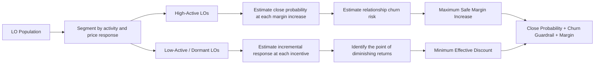

# Dynamic Pricing for Wholesale Lending: The Concrete Picture

## Executive idea

Use one machine-learning framework to make two different pricing decisions:

- For **high-active loan officers**, identify the maximum lender-margin increase that still protects closing probability and the long-term relationship.
- For **low-active or dormant loan officers**, identify the minimum incentive that creates a meaningful increase in re-engagement.

The model is not simply saying “charge active LOs more” and “discount inactive LOs.” It estimates how each LO is expected to respond to a controlled change in basis points.

## The business problem

The LO population contains very different types of relationships:

| Population | Business opportunity | Business risk | Model output |
|---|---|---|---|
| High-active / high-volume | Capture incremental spread | Current-loan fallout or future churn | Maximum safe margin increase |
| Low-active / dormant | Create incremental volume | Giving away margin without changing behavior | Minimum effective discount |

The objective is to move away from a blanket adjustment and toward bounded, evidence-based pricing decisions.

## Holistic decision flow

## What the model considers

The response curve can incorporate five groups of explanatory variables:

1. **Pricing and margin**
   - Current lender margin
   - Note-rate adjustment
   - Previous concessions
   - Incremental spread being tested

2. **LO profile**
   - Monthly volume
   - Pull-through rate
   - Average loan size
   - Tenure
   - Referral concentration

3. **Loan characteristics**
   - Product and purpose
   - Loan amount
   - FICO, LTV, and DTI
   - Occupancy and property type

4. **Market and competition**
   - Market spread
   - Competitor activity
   - Wallet share
   - Rate-shopping behavior

5. **Operational engagement**
   - Recent submissions and locks
   - Concession-request frequency
   - Tool usage
   - Days since last meaningful activity

## The scientific idea in business language

The model estimates a **response curve**: the predicted probability of closing at each approved BPS adjustment.

- A **regression coefficient** describes how strongly a factor is associated with the outcome.
- **Price elasticity** describes how quickly closing probability changes when pricing changes.
- **Incremental spread** is the additional margin captured compared with the current pricing position.
- **Uplift modeling** estimates whether an incentive actually changes behavior, rather than merely identifying LOs who were already likely to close.
- **Calibration** checks whether a predicted 70% probability actually behaves like approximately 70% in observed results.

## The four practical LO flags

### High-active LOs

- **Stretch:** Strong closing behavior and relatively low price sensitivity create an opportunity to capture incremental spread.
- **Protect:** Rate-shopping, repeated concessions, or declining wallet share suggest that additional margin could weaken the relationship.

### Low-active LOs

- **Reactivate:** Prior production and strong modeled incentive response justify a targeted discount.
- **Hold back:** Low underlying opportunity or weak modeled uplift means that a deeper discount is unlikely to generate enough incremental volume.

## What leadership receives

For every eligible LO or pricing opportunity, the decision engine can return:

- Current predicted closing probability
- Predicted closing probability at each approved BPS adjustment
- Estimated price sensitivity
- Estimated churn or re-engagement probability
- Recommended adjustment
- Reason for the recommendation
- Expected incremental margin or incremental volume
- Confidence level and applicable guardrails

## Leadership takeaway

The proposed approach replaces one-size-fits-all pricing with a controlled decision:

> Stretch margin where the relationship can safely absorb it, protect price-sensitive high-value LOs, and use incentives only where they are expected to create incremental behavior.

