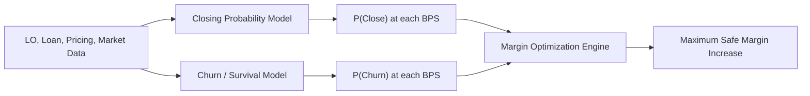

# High-Active LOs: Margin Optimization with Churn Prediction

## Business question

For a high-active LO, how many additional basis points can the lender capture before:

1. The probability of closing the current opportunity declines too far, or
2. The probability of damaging the future relationship exceeds the approved limit?

These are related but different outcomes.

- **Current-loan fallout** means the present opportunity does not close.
- **Relationship churn** means the LO materially reduces or stops future business.

The recommended margin must account for both.

## Combined modeling approach

## Model 1: Probability of closing

The first model predicts the probability that the current opportunity closes at each approved margin adjustment.

A practical starting point is a **logistic regression** or a **generalized additive model**.

The statistical structure can include:

- A BPS adjustment variable
- LO production and relationship variables
- Loan characteristics
- Market competitiveness
- Interaction terms between BPS and LO behavior

An **interaction coefficient** allows the model to learn that the same 10-BPS increase can affect two LOs differently.

For example:

- A long-tenured LO with strong pull-through may have a relatively flat response curve.
- A frequent rate shopper with declining wallet share may have a steep response curve.

More advanced versions can use gradient boosting with **monotonic constraints**, ensuring that increasingly expensive pricing does not unrealistically increase the predicted probability of closing.

## Model 2: Probability of churn

The churn model predicts the probability that a currently valuable LO reduces meaningful activity after exposure to a pricing change.

### Step 1: Define churn

Churn needs a specific time horizon and behavioral definition. One possible definition is:

> An LO who was previously active but produces no meaningful quote, submission, lock, or funded loan during the next 90 days.

The final definition should distinguish between:

- True relationship loss
- Temporary market inactivity
- Seasonality
- Lack of available borrower demand

### Step 2: Construct the churn label

Create one observation per LO-week or LO-month:

- `1` if the LO enters the defined churn state within the next 90 days
- `0` if the LO remains meaningfully engaged

The model should only use information available before the prediction date. This prevents **target leakage**, where future information accidentally enters the training data.

### Step 3: Select model types

Useful modeling approaches include:

- **Logistic regression:** Produces interpretable coefficients for a fixed churn horizon.
- **Survival analysis:** Predicts when churn is likely to occur and handles relationships that have not yet churned.
- **Cox proportional-hazards regression:** Estimates how each variable changes the churn hazard.
- **Gradient-boosted survival model:** Captures nonlinear relationships and complex interactions.
- **Hierarchical regression:** Uses partial pooling so LOs with limited history borrow statistical strength from similar brokers or segments.

### Step 4: Include pricing exposure

The churn model should contain features such as:

- Average margin increase during the recent period
- Frequency and size of pricing changes
- Concession-request frequency
- Rate-shop frequency
- Change in wallet share
- Change in submission and lock velocity
- Pull-through trend
- Tenure and prior production
- Market and seasonal controls

The coefficient on pricing exposure provides an initial estimate of how margin changes are associated with churn. However, an ordinary regression may still contain **confounding bias** because pricing adjustments are not assigned randomly.

### Step 5: Estimate incremental churn

The ideal question is not simply:

> Who is likely to churn?

It is:

> How much additional churn risk is caused by this margin increase?

That requires a causal or **uplift modeling** framework. Controlled price tests within approved corridors create treatment and control observations:

- Control: existing pricing
- Treatment: approved incremental margin increase

The resulting model estimates the **incremental churn effect** caused by the treatment.

## How churn and margin are optimized together

For each approved BPS adjustment, the engine calculates:

- Predicted probability of closing
- Predicted probability of funding after a lock
- Expected current-loan margin
- Predicted 90-day churn probability
- Estimated long-term relationship value
- Incremental spread versus the current price

The engine then selects the highest-margin option that satisfies the guardrails:

- Churn probability remains below the approved threshold, such as 5%
- Closing probability remains above a business-defined floor
- Expected contribution is greater than or equal to the current pricing strategy
- The recommendation stays inside the permitted pricing corridor

## Illustrative decision table

The following numbers are purely illustrative:

| Margin increase | Predicted close probability | Predicted 90-day churn | Decision |
|---:|---:|---:|---|
| +8 BPS | 93.6% | 2.2% | Safe |
| +16 BPS | 92.4% | 4.7% | Maximum safe stretch |
| +24 BPS | 88.4% | 7.1% | Exceeds churn guardrail |

The business interpretation is straightforward:

> The LO can absorb a 16-BPS increase in this example, but the next pricing step creates more relationship risk than the lender is willing to accept.

## Model validation

The model should be evaluated using:

- **AUC / ROC:** Measures ranking quality
- **Brier score:** Measures probability accuracy
- **Calibration curve:** Compares predicted probabilities with observed results
- **Out-of-time validation:** Tests the model on a later period
- **Coefficient stability:** Checks whether key relationships remain consistent
- **Confidence intervals:** Communicate statistical uncertainty
- **Population stability index:** Detects changes in the scoring population

For leadership, calibration is more important than a high AUC alone. If the model says churn risk is 4%, the observed churn rate for similar predictions should be close to 4%.

## Operational output

The production output for a high-active LO should be simple:

- Recommended margin increase
- Predicted close probability at the recommendation
- Predicted churn probability
- Incremental spread captured
- Confidence level
- Primary drivers
- “Stretch,” “Protect,” or “No change” flag

## Key scientific terminology

- **Regression coefficient:** Estimated directional impact of a predictor
- **Elasticity:** Sensitivity of closing behavior to price
- **Hazard rate:** Instantaneous risk that churn occurs
- **Survival probability:** Probability that the relationship remains active
- **Uplift:** Incremental effect caused by the pricing treatment
- **Confounding:** Distortion caused when treatment assignment is related to underlying risk
- **Calibration:** Agreement between predicted and observed probabilities
- **Incremental spread:** Additional BPS captured relative to the baseline

## Leadership takeaway

The churn model is not an independent dashboard metric. It becomes a constraint inside the margin optimizer:

> Capture incremental spread only while both current conversion and future relationship health remain inside the approved corridor.

