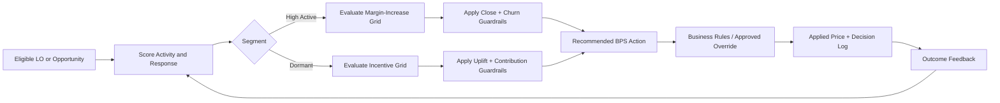

# Operating Model, Pilot, and Rollout

## Objective

Move from an illustrative pricing concept to a controlled production decision system without immediately turning the model loose on the entire LO population.

The rollout should prove three things:

1. The probability estimates are reliable.
2. The recommended actions generate incremental economic value.
3. The guardrails prevent unacceptable conversion or relationship deterioration.

## Proposed rollout

### Phase 1: Define and instrument

Deliverables:

- Final high-active and low-active definitions
- Close, churn, and reactivation labels
- Complete opportunity-level logging
- Approved pricing corridors
- Baseline economics
- Leadership and compliance guardrails

Scientific concepts:

- Data lineage
- Label integrity
- Feature engineering
- Baseline regression
- Descriptive coefficient analysis

### Phase 2: Build the baseline models

Build:

- Closing probability model
- Churn or survival model
- Dormant-LO reactivation model
- Initial response curves

Run them in **shadow mode**, where the system makes recommendations but does not alter pricing.

Shadow mode allows the team to compare:

- Model recommendation
- Actual applied price
- Actual outcome
- Estimated incremental opportunity

### Phase 3: Controlled pilot

Select limited, comparable cohorts and test only within approved BPS bands.

The pilot should contain:

- Control and treatment groups
- Predefined success metrics
- Predefined stopping rules
- Permanent holdout population
- Daily risk monitoring
- Weekly business review

This produces causal evidence for uplift and incremental spread.

### Phase 4: Constrained production

Introduce the model as a recommendation engine:

- Model proposes the action
- Business rules apply floors, ceilings, and exclusions
- Authorized users can override with a documented reason
- Every decision is logged

Begin with narrow segments where calibration and confidence are strongest.

### Phase 5: Scale and optimize

After the pilot demonstrates positive policy value:

- Expand eligible segments
- Add finer response curves
- Introduce champion-challenger testing
- Re-estimate treatment effects
- Refine lifetime-value and churn costs
- Automate routine monitoring

## Daily decision workflow

## Leadership dashboard

Leadership should receive a concise view of:

### Portfolio outcomes

- Funded volume
- Contribution margin
- Incremental spread
- Incremental locks
- Churn rate
- Reactivation rate
- Margin saved versus blanket incentives

### Model performance

- Calibration
- Confidence intervals
- Uplift by model decile
- Coefficient and feature stability
- Population and prediction drift
- Policy value versus control

### Risk and governance

- Recommendations outside the approved corridor
- Override frequency
- Performance by business segment
- Complaint or escalation signals
- Data-quality exceptions

## Decision flags

The production system can return one of four primary flags:

| Flag | Meaning | Typical action |
|---|---|---|
| Stretch | High-active LO with acceptable price sensitivity | Increase margin within guardrail |
| Protect | High-active LO with elevated relationship risk | Hold or reduce the proposed increase |
| Reactivate | Dormant LO with positive incremental uplift | Offer minimum effective incentive |
| Hold back | Dormant LO with weak incremental response | Avoid unnecessary discount |

An additional **insufficient confidence** flag should suppress individualized recommendations for sparse or out-of-range observations.

## Guardrails

Potential guardrails include:

- Maximum BPS movement per decision
- Maximum cumulative movement over a defined period
- Closing-probability floor
- Churn-probability ceiling
- Minimum expected incremental contribution
- Minimum uplift threshold
- Minimum model confidence
- Product, state, broker, or channel exclusions
- Manual review for strategically important relationships

Guardrails transform a predictive model into a controlled **decision policy**.

## Stop conditions

Pause or reduce a treatment when:

- Churn exceeds the approved threshold
- Closing probability materially underperforms prediction
- Incremental contribution becomes negative
- Calibration deteriorates
- A segment experiences significant data drift
- Override or complaint frequency increases unexpectedly
- Experiment balance or data quality is compromised

These are sometimes called **sequential monitoring boundaries**.

## Roles

| Role | Primary responsibility |
|---|---|
| Business leadership | Objective, economics, and risk appetite |
| Pricing | Approved BPS corridors and margin rules |
| Sales leadership | Relationship interpretation and override policy |
| Data science | Models, uplift estimation, calibration, and monitoring |
| Data engineering | Opportunity and outcome data quality |
| Model risk / validation | Independent challenge and performance review |
| Compliance / legal | Permitted variables, treatments, and monitoring |
| Product / technology | Workflow integration and decision logging |

## Suggested 90-day sequence

### Days 1–30

- Confirm definitions
- Audit opportunity and pricing data
- Establish baseline metrics
- Build interpretable regression models
- Design approved pilot corridors

### Days 31–60

- Produce LO response curves
- Build and calibrate churn and reactivation models
- Run shadow recommendations
- Complete experiment power analysis
- Finalize pilot cohorts and stop conditions

### Days 61–90

- Launch controlled pilot
- Review daily guardrails
- Report weekly incremental results
- Recalibrate when necessary
- Prepare scale or pause recommendation

## Technical terminology in plain language

- **Decision policy:** Rule that converts predictions into an action
- **Policy value:** Expected economic result of following the model
- **Champion-challenger:** Controlled comparison between current and candidate models
- **Shadow mode:** Model runs without changing real decisions
- **Drift:** Change in data or behavior over time
- **Sequential monitoring:** Repeated evaluation while an experiment is running
- **Override analysis:** Study of when users reject the recommendation and what happens afterward
- **Closed-loop learning:** Outcomes are returned to improve future estimates

## Leadership takeaway

The model should be introduced as a controlled operating capability, not a one-time score:

> Start in shadow mode, prove incremental value through a bounded pilot, and scale only where calibration, economics, and relationship guardrails remain strong.

