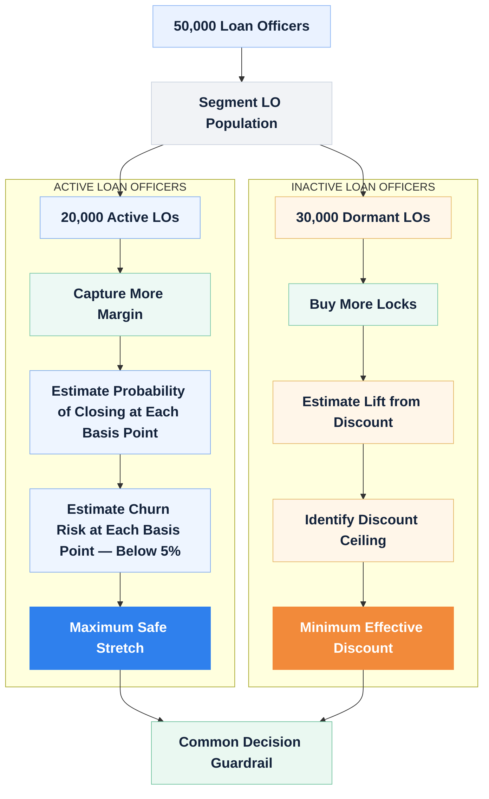

```mermaid
flowchart TB
    A["50,000 Loan Officers"]
    B["Segment LO Population"]

    A --> B

    subgraph HIGH["ACTIVE LOAN OFFICERS"]
        direction TB
        H0["20,000 Active LOs"]
        HG["Capture More Margin"]
        H1["Estimate Probability of Closing at Each Basis Point"]
        H2["Estimate Churn Risk at Each Basis Point — Below 5%"]
        H3["Maximum Safe Stretch"]

        H0 --> HG --> H1 --> H2 --> H3
    end

    subgraph LOW["INACTIVE LOAN OFFICERS"]
        direction TB
        L0["30,000 Dormant LOs"]
        LG["Buy More Locks"]
        L1["Estimate Lift from Discount"]
        L2["Identify Discount Ceiling"]
        L3["Minimum Effective Discount"]

        L0 --> LG --> L1 --> L2 --> L3
    end

    B --> H0
    B --> L0

    K["Common Decision Guardrail"]

    H3 --> K
    L3 --> K

    classDef population fill:#eaf2ff,stroke:#8eb6f4,color:#14233b,stroke-width:1px,font-size:20px,font-weight:bold;
    classDef segment fill:#f1f3f6,stroke:#cbd3df,color:#14233b,stroke-width:1px,font-size:20px,font-weight:bold;
    classDef active fill:#eef5ff,stroke:#82adef,color:#14233b,stroke-width:1px,font-size:20px,font-weight:bold;
    classDef inactive fill:#fff6e9,stroke:#e6b96c,color:#14233b,stroke-width:1px,font-size:20px,font-weight:bold;
    classDef goal fill:#edf9f4,stroke:#7fc9ab,color:#14233b,stroke-width:1px,font-size:20px,font-weight:bold;
    classDef activeOutput fill:#2f80ed,stroke:#2f80ed,color:#ffffff,stroke-width:1px,font-size:20px,font-weight:bold;
    classDef inactiveOutput fill:#f28a3a,stroke:#f28a3a,color:#ffffff,stroke-width:1px,font-size:20px,font-weight:bold;
    classDef guardrail fill:#eaf8f1,stroke:#77c5a3,color:#14233b,stroke-width:1px,font-size:20px,font-weight:bold;

    class A population;
    class B segment;
    class H0,H1,H2 active;
    class L0,L1,L2 inactive;
    class HG,LG goal;
    class H3 activeOutput;
    class L3 inactiveOutput;
    class K guardrail;
```
