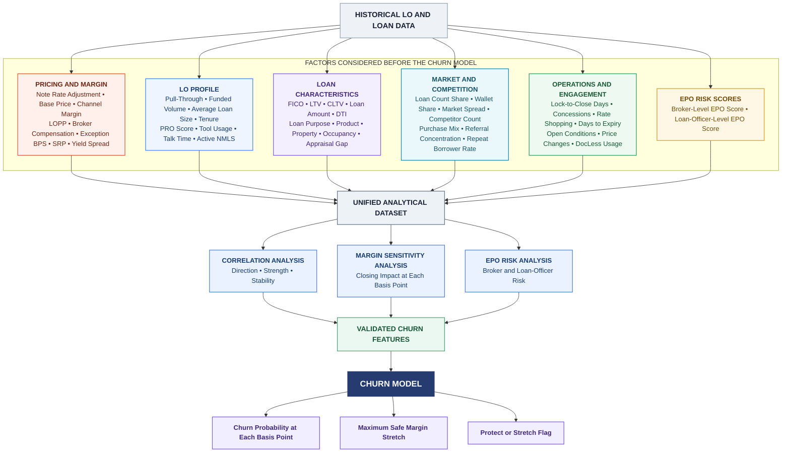

```mermaid
flowchart TB
    A["HISTORICAL LO AND LOAN DATA"]

    subgraph F["FACTORS CONSIDERED BEFORE THE CHURN MODEL"]
        direction TB

        P["<b>PRICING AND MARGIN</b><br/>Note Rate Adjustment • Base Price • Channel Margin<br/>LOPP • Broker Compensation • Exception BPS • SRP • Yield Spread"]
        O["<b>LO PROFILE</b><br/>Pull-Through • Funded Volume • Average Loan Size • Tenure<br/>PRO Score • Tool Usage • Talk Time • Active NMLS"]
        L["<b>LOAN CHARACTERISTICS</b><br/>FICO • LTV • CLTV • Loan Amount • DTI<br/>Loan Purpose • Product • Property • Occupancy • Appraisal Gap"]
        M["<b>MARKET AND COMPETITION</b><br/>Loan Count Share • Wallet Share • Market Spread • Competitor Count<br/>Purchase Mix • Referral Concentration • Repeat Borrower Rate"]
        E["<b>OPERATIONS AND ENGAGEMENT</b><br/>Lock-to-Close Days • Concessions • Rate Shopping • Days to Expiry<br/>Open Conditions • Price Changes • DocLess Usage"]
        R["<b>EPO RISK SCORES</b><br/>Broker-Level EPO Score • Loan-Officer-Level EPO Score"]
    end

    A --> P
    A --> O
    A --> L
    A --> M
    A --> E
    A --> R

    D["UNIFIED ANALYTICAL DATASET"]

    P --> D
    O --> D
    L --> D
    M --> D
    E --> D
    R --> D

    C["<b>CORRELATION ANALYSIS</b><br/>Direction • Strength • Stability"]
    S["<b>MARGIN SENSITIVITY ANALYSIS</b><br/>Closing Impact at Each Basis Point"]
    EP["<b>EPO RISK ANALYSIS</b><br/>Broker and Loan-Officer Risk"]

    D --> C
    D --> S
    D --> EP

    V["VALIDATED CHURN FEATURES"]

    C --> V
    S --> V
    EP --> V

    CH["CHURN MODEL"]
    V --> CH

    CH --> O1["Churn Probability at Each Basis Point"]
    CH --> O2["Maximum Safe Margin Stretch"]
    CH --> O3["Protect or Stretch Flag"]

    classDef source fill:#eef2f7,stroke:#94a3b8,color:#172033,stroke-width:1.5px,font-size:18px,font-weight:bold;
    classDef pricing fill:#fff0ec,stroke:#d95d39,color:#6f2614,stroke-width:1.5px;
    classDef profile fill:#eef5ff,stroke:#3b82f6,color:#173d73,stroke-width:1.5px;
    classDef loan fill:#f4efff,stroke:#7c5ce0,color:#3f277c,stroke-width:1.5px;
    classDef market fill:#eaf8fb,stroke:#1687a7,color:#155269,stroke-width:1.5px;
    classDef operations fill:#edf9f1,stroke:#2d9b5f,color:#175934,stroke-width:1.5px;
    classDef epo fill:#fff7e6,stroke:#d99a25,color:#704b09,stroke-width:1.5px;
    classDef dataset fill:#edf2f7,stroke:#64748b,color:#172033,stroke-width:1.5px,font-size:17px,font-weight:bold;
    classDef analysis fill:#eaf2ff,stroke:#4f7fce,color:#173d73,stroke-width:1.5px;
    classDef validated fill:#eaf8f1,stroke:#45a675,color:#185638,stroke-width:1.5px,font-size:17px,font-weight:bold;
    classDef model fill:#263c70,stroke:#263c70,color:#ffffff,stroke-width:1.5px,font-size:20px,font-weight:bold;
    classDef output fill:#f1efff,stroke:#7c5ce0,color:#3f277c,stroke-width:1.5px,font-size:16px,font-weight:bold;

    class A source;
    class P pricing;
    class O profile;
    class L loan;
    class M market;
    class E operations;
    class R epo;
    class D dataset;
    class C,S,EP analysis;
    class V validated;
    class CH model;
    class O1,O2,O3 output;
```
