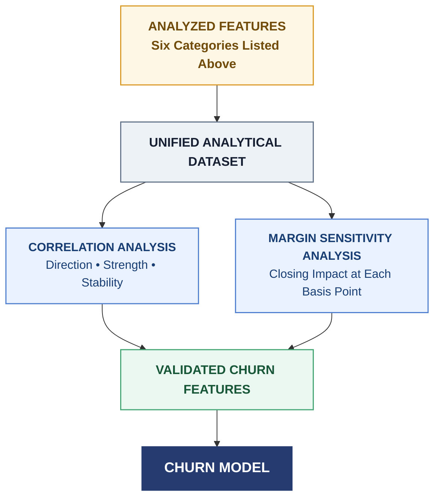

# Pre-Churn Model Feature Categories

<table style="width:100%; table-layout:fixed; border-collapse:separate; border-spacing:0; border:1px solid #cbd5e1; border-radius:10px; overflow:hidden; margin:18px 0 30px 0; font-family:Arial, sans-serif;">
  <colgroup>
    <col style="width:7%;">
    <col style="width:31%;">
    <col style="width:31%;">
    <col style="width:31%;">
  </colgroup>
  <thead>
    <tr>
      <th style="height:48px; padding:0 14px; text-align:center; vertical-align:middle; background:#334155; color:#ffffff; border-right:1px solid #ffffff; font-size:16px;">#</th>
      <th style="height:48px; padding:0 18px; text-align:left; vertical-align:middle; background:#b8442e; color:#ffffff; border-right:1px solid #ffffff; font-size:16px;">Pricing &amp; Margin</th>
      <th style="height:48px; padding:0 18px; text-align:left; vertical-align:middle; background:#2f64b4; color:#ffffff; border-right:1px solid #ffffff; font-size:16px;">LO Profile</th>
      <th style="height:48px; padding:0 18px; text-align:left; vertical-align:middle; background:#6546a8; color:#ffffff; font-size:16px;">Loan Characteristics</th>
    </tr>
  </thead>
  <tbody>
    <tr>
      <td style="height:44px; padding:0 14px; text-align:center; vertical-align:middle; background:#f1f5f9; border-top:1px solid #dbe2ea; border-right:1px solid #dbe2ea;">1</td>
      <td style="height:44px; padding:0 18px; text-align:left; vertical-align:middle; background:#fff4f0; border-top:1px solid #ead8d2; border-right:1px solid #dbe2ea;">Note Rate Adjustment (BPS)</td>
      <td style="height:44px; padding:0 18px; text-align:left; vertical-align:middle; background:#f1f6fd; border-top:1px solid #d7e2f1; border-right:1px solid #dbe2ea;">Pull-Through Rate</td>
      <td style="height:44px; padding:0 18px; text-align:left; vertical-align:middle; background:#f6f2fc; border-top:1px solid #e0d8f0;">Credit Score / FICO</td>
    </tr>
    <tr>
      <td style="height:44px; padding:0 14px; text-align:center; vertical-align:middle; background:#f1f5f9; border-top:1px solid #dbe2ea; border-right:1px solid #dbe2ea;">2</td>
      <td style="height:44px; padding:0 18px; text-align:left; vertical-align:middle; background:#fff4f0; border-top:1px solid #ead8d2; border-right:1px solid #dbe2ea;">Base Price</td>
      <td style="height:44px; padding:0 18px; text-align:left; vertical-align:middle; background:#f1f6fd; border-top:1px solid #d7e2f1; border-right:1px solid #dbe2ea;">Monthly Funded Volume</td>
      <td style="height:44px; padding:0 18px; text-align:left; vertical-align:middle; background:#f6f2fc; border-top:1px solid #e0d8f0;">LTV Ratio</td>
    </tr>
    <tr>
      <td style="height:44px; padding:0 14px; text-align:center; vertical-align:middle; background:#f1f5f9; border-top:1px solid #dbe2ea; border-right:1px solid #dbe2ea;">3</td>
      <td style="height:44px; padding:0 18px; text-align:left; vertical-align:middle; background:#fff4f0; border-top:1px solid #ead8d2; border-right:1px solid #dbe2ea;">Channel Margin</td>
      <td style="height:44px; padding:0 18px; text-align:left; vertical-align:middle; background:#f1f6fd; border-top:1px solid #d7e2f1; border-right:1px solid #dbe2ea;">Average Loan Size</td>
      <td style="height:44px; padding:0 18px; text-align:left; vertical-align:middle; background:#f6f2fc; border-top:1px solid #e0d8f0;">CLTV Ratio</td>
    </tr>
    <tr>
      <td style="height:44px; padding:0 14px; text-align:center; vertical-align:middle; background:#f1f5f9; border-top:1px solid #dbe2ea; border-right:1px solid #dbe2ea;">4</td>
      <td style="height:44px; padding:0 18px; text-align:left; vertical-align:middle; background:#fff4f0; border-top:1px solid #ead8d2; border-right:1px solid #dbe2ea;">LOPP / Price Points</td>
      <td style="height:44px; padding:0 18px; text-align:left; vertical-align:middle; background:#f1f6fd; border-top:1px solid #d7e2f1; border-right:1px solid #dbe2ea;">Tenure</td>
      <td style="height:44px; padding:0 18px; text-align:left; vertical-align:middle; background:#f6f2fc; border-top:1px solid #e0d8f0;">Loan Amount</td>
    </tr>
    <tr>
      <td style="height:44px; padding:0 14px; text-align:center; vertical-align:middle; background:#f1f5f9; border-top:1px solid #dbe2ea; border-right:1px solid #dbe2ea;">5</td>
      <td style="height:44px; padding:0 18px; text-align:left; vertical-align:middle; background:#fff4f0; border-top:1px solid #ead8d2; border-right:1px solid #dbe2ea;">Broker Compensation</td>
      <td style="height:44px; padding:0 18px; text-align:left; vertical-align:middle; background:#f1f6fd; border-top:1px solid #d7e2f1; border-right:1px solid #dbe2ea;">PRO Score</td>
      <td style="height:44px; padding:0 18px; text-align:left; vertical-align:middle; background:#f6f2fc; border-top:1px solid #e0d8f0;">DTI / Back-End</td>
    </tr>
    <tr>
      <td style="height:44px; padding:0 14px; text-align:center; vertical-align:middle; background:#f1f5f9; border-top:1px solid #dbe2ea; border-right:1px solid #dbe2ea;">6</td>
      <td style="height:44px; padding:0 18px; text-align:left; vertical-align:middle; background:#fff4f0; border-top:1px solid #ead8d2; border-right:1px solid #dbe2ea;">AE Exception BPS</td>
      <td style="height:44px; padding:0 18px; text-align:left; vertical-align:middle; background:#f1f6fd; border-top:1px solid #d7e2f1; border-right:1px solid #dbe2ea;">Ultimate Tool Usage</td>
      <td style="height:44px; padding:0 18px; text-align:left; vertical-align:middle; background:#f6f2fc; border-top:1px solid #e0d8f0;">Loan Purpose</td>
    </tr>
    <tr>
      <td style="height:44px; padding:0 14px; text-align:center; vertical-align:middle; background:#f1f5f9; border-top:1px solid #dbe2ea; border-right:1px solid #dbe2ea;">7</td>
      <td style="height:44px; padding:0 18px; text-align:left; vertical-align:middle; background:#fff4f0; border-top:1px solid #ead8d2; border-right:1px solid #dbe2ea;">Yield Spread Premium</td>
      <td style="height:44px; padding:0 18px; text-align:left; vertical-align:middle; background:#f1f6fd; border-top:1px solid #d7e2f1; border-right:1px solid #dbe2ea;">Talk Time</td>
      <td style="height:44px; padding:0 18px; text-align:left; vertical-align:middle; background:#f6f2fc; border-top:1px solid #e0d8f0;">Product Type</td>
    </tr>
  </tbody>
</table>

<table style="width:100%; table-layout:fixed; border-collapse:separate; border-spacing:0; border:1px solid #cbd5e1; border-radius:10px; overflow:hidden; margin:0 0 18px 0; font-family:Arial, sans-serif;">
  <colgroup>
    <col style="width:7%;">
    <col style="width:31%;">
    <col style="width:31%;">
    <col style="width:31%;">
  </colgroup>
  <thead>
    <tr>
      <th style="height:48px; padding:0 14px; text-align:center; vertical-align:middle; background:#334155; color:#ffffff; border-right:1px solid #ffffff; font-size:16px;">#</th>
      <th style="height:48px; padding:0 18px; text-align:left; vertical-align:middle; background:#147d92; color:#ffffff; border-right:1px solid #ffffff; font-size:16px;">Market &amp; Competition</th>
      <th style="height:48px; padding:0 18px; text-align:left; vertical-align:middle; background:#2c8a5b; color:#ffffff; border-right:1px solid #ffffff; font-size:16px;">Operations &amp; Engagement</th>
      <th style="height:48px; padding:0 18px; text-align:left; vertical-align:middle; background:#b7791f; color:#ffffff; font-size:16px;">EPO Risk Scores</th>
    </tr>
  </thead>
  <tbody>
    <tr>
      <td style="height:44px; padding:0 14px; text-align:center; vertical-align:middle; background:#f1f5f9; border-top:1px solid #dbe2ea; border-right:1px solid #dbe2ea;">1</td>
      <td style="height:44px; padding:0 18px; text-align:left; vertical-align:middle; background:#edf8fa; border-top:1px solid #d4e7eb; border-right:1px solid #dbe2ea;">Loan Count Share</td>
      <td style="height:44px; padding:0 18px; text-align:left; vertical-align:middle; background:#eef8f2; border-top:1px solid #d3e8da; border-right:1px solid #dbe2ea;">Lock-to-Close Days</td>
      <td style="height:44px; padding:0 18px; text-align:left; vertical-align:middle; background:#fff8e8; border-top:1px solid #eadfbe;">Broker-Level EPO Score</td>
    </tr>
    <tr>
      <td style="height:44px; padding:0 14px; text-align:center; vertical-align:middle; background:#f1f5f9; border-top:1px solid #dbe2ea; border-right:1px solid #dbe2ea;">2</td>
      <td style="height:44px; padding:0 18px; text-align:left; vertical-align:middle; background:#edf8fa; border-top:1px solid #d4e7eb; border-right:1px solid #dbe2ea;">Wallet Share</td>
      <td style="height:44px; padding:0 18px; text-align:left; vertical-align:middle; background:#eef8f2; border-top:1px solid #d3e8da; border-right:1px solid #dbe2ea;">Concession Request Frequency</td>
      <td style="height:44px; padding:0 18px; text-align:left; vertical-align:middle; background:#fff8e8; border-top:1px solid #eadfbe;">Loan-Officer-Level EPO Score</td>
    </tr>
    <tr>
      <td style="height:44px; padding:0 14px; text-align:center; vertical-align:middle; background:#f1f5f9; border-top:1px solid #dbe2ea; border-right:1px solid #dbe2ea;">3</td>
      <td style="height:44px; padding:0 18px; text-align:left; vertical-align:middle; background:#edf8fa; border-top:1px solid #d4e7eb; border-right:1px solid #dbe2ea;">Market Spread</td>
      <td style="height:44px; padding:0 18px; text-align:left; vertical-align:middle; background:#eef8f2; border-top:1px solid #d3e8da; border-right:1px solid #dbe2ea;">Rate-Shop Frequency</td>
      <td style="height:44px; padding:0 18px; text-align:left; vertical-align:middle; background:#fff8e8; border-top:1px solid #eadfbe;">Recent EPO Rate</td>
    </tr>
    <tr>
      <td style="height:44px; padding:0 14px; text-align:center; vertical-align:middle; background:#f1f5f9; border-top:1px solid #dbe2ea; border-right:1px solid #dbe2ea;">4</td>
      <td style="height:44px; padding:0 18px; text-align:left; vertical-align:middle; background:#edf8fa; border-top:1px solid #d4e7eb; border-right:1px solid #dbe2ea;">Competitor Count</td>
      <td style="height:44px; padding:0 18px; text-align:left; vertical-align:middle; background:#eef8f2; border-top:1px solid #d3e8da; border-right:1px solid #dbe2ea;">Days to Lock Expiry</td>
      <td style="height:44px; padding:0 18px; text-align:left; vertical-align:middle; background:#fff8e8; border-top:1px solid #eadfbe;">EPO Count</td>
    </tr>
    <tr>
      <td style="height:44px; padding:0 14px; text-align:center; vertical-align:middle; background:#f1f5f9; border-top:1px solid #dbe2ea; border-right:1px solid #dbe2ea;">5</td>
      <td style="height:44px; padding:0 18px; text-align:left; vertical-align:middle; background:#edf8fa; border-top:1px solid #d4e7eb; border-right:1px solid #dbe2ea;">Purchase Mix</td>
      <td style="height:44px; padding:0 18px; text-align:left; vertical-align:middle; background:#eef8f2; border-top:1px solid #d3e8da; border-right:1px solid #dbe2ea;">Open Condition Count</td>
      <td style="height:44px; padding:0 18px; text-align:left; vertical-align:middle; background:#fff8e8; border-top:1px solid #eadfbe;">EPO Loan-Balance Exposure</td>
    </tr>
    <tr>
      <td style="height:44px; padding:0 14px; text-align:center; vertical-align:middle; background:#f1f5f9; border-top:1px solid #dbe2ea; border-right:1px solid #dbe2ea;">6</td>
      <td style="height:44px; padding:0 18px; text-align:left; vertical-align:middle; background:#edf8fa; border-top:1px solid #d4e7eb; border-right:1px solid #dbe2ea;">Referral Concentration</td>
      <td style="height:44px; padding:0 18px; text-align:left; vertical-align:middle; background:#eef8f2; border-top:1px solid #d3e8da; border-right:1px solid #dbe2ea;">Price Change Count</td>
      <td style="height:44px; padding:0 18px; text-align:left; vertical-align:middle; background:#fff8e8; border-top:1px solid #eadfbe;">EPO Trend</td>
    </tr>
    <tr>
      <td style="height:44px; padding:0 14px; text-align:center; vertical-align:middle; background:#f1f5f9; border-top:1px solid #dbe2ea; border-right:1px solid #dbe2ea;">7</td>
      <td style="height:44px; padding:0 18px; text-align:left; vertical-align:middle; background:#edf8fa; border-top:1px solid #d4e7eb; border-right:1px solid #dbe2ea;">Repeat Borrower Rate</td>
      <td style="height:44px; padding:0 18px; text-align:left; vertical-align:middle; background:#eef8f2; border-top:1px solid #d3e8da; border-right:1px solid #dbe2ea;">DocLess Usage</td>
      <td style="height:44px; padding:0 18px; text-align:left; vertical-align:middle; background:#fff8e8; border-top:1px solid #eadfbe;">EPO Concentration</td>
    </tr>
  </tbody>
</table>

## Analysis Flow

